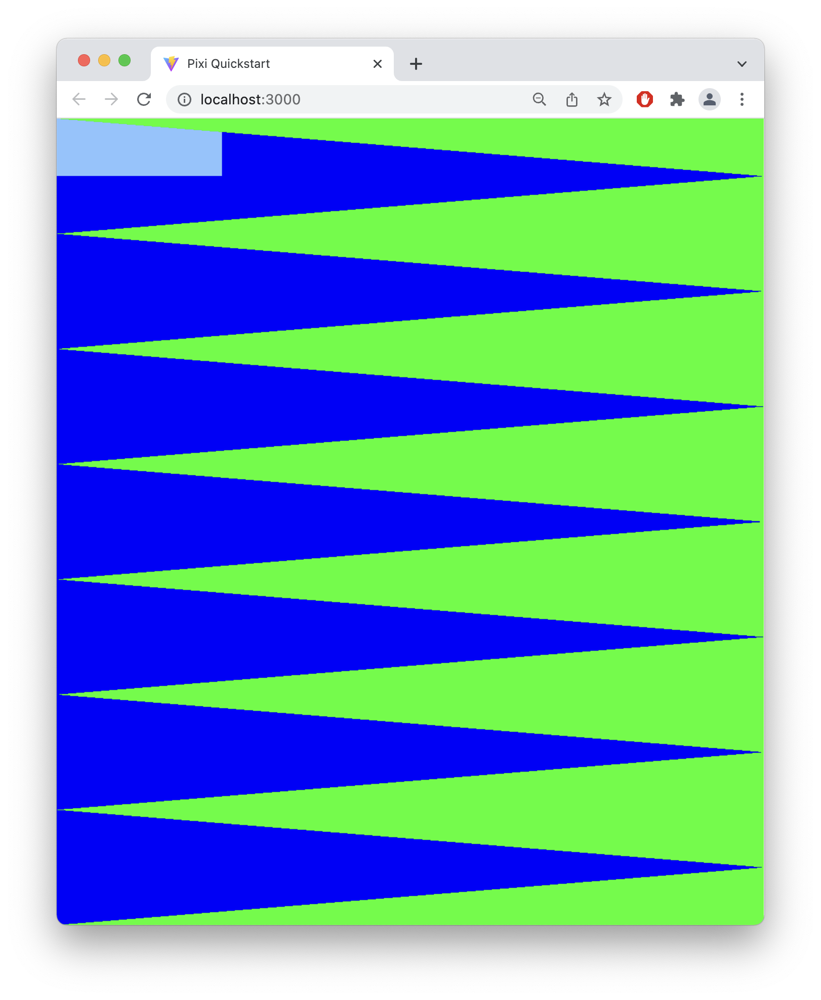

# Novel Clock

I am still trying to make my idea work, but here is what I am thinking...

So, I made a graphic out of multiple right triangles.

Blue triangles represent seconds

Green triangles represent minutes

A rectangle formed by blue and green triangles represent hours
There are 12 rectangles each representing an hour of the day.

The color scheme of the entire graphic will change when the time reaches noon. (am to pm)

So far I have one rectangle working
I am having trouble forming a way to repeat this process for all 12 rectangles.

I'm also getting some type errors with my arrays which won't let me compile the code??? 

